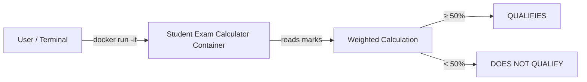
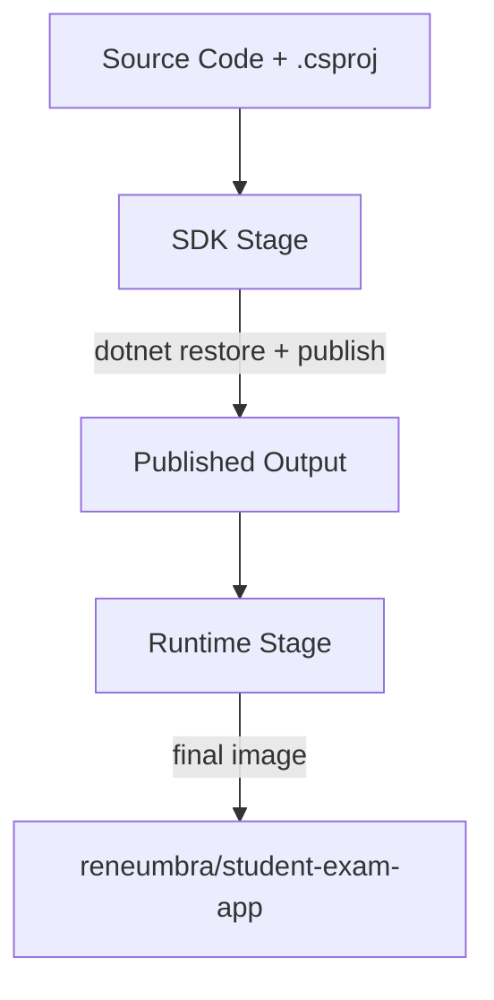
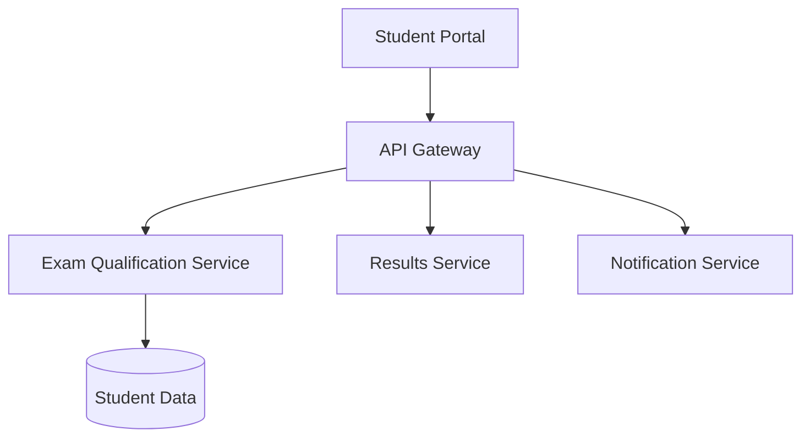

# Architecture Diagrams

## High-level view of the containerized application

```mermaid
flowchart LR
    User[User / Terminal] -->|docker run -it| Container
    Container[Student Exam Calculator Container]
    Container -->|reads marks| Logic[Weighted Calculation]
    Logic -->|≥ 50%| Pass[QUALIFIES]
    Logic -->|< 50%| Fail[DOES NOT QUALIFY]
```

## Multi-stage Docker build

```mermaid
flowchart TD
    A[Source Code + .csproj] --> B[SDK Stage]
    B -->|dotnet restore + publish| C[Published Output]
    C --> D[Runtime Stage]
    D -->|final image| E[reneumbra/student-exam-app]
```

## Future microservices vision (optional discussion)

```mermaid
flowchart TB
    Portal[Student Portal] --> API[API Gateway]
    API --> Calc[Exam Qualification Service]
    API --> Results[Results Service]
    API --> Notify[Notification Service]
    Calc --> DB[(Student Data)]
```
